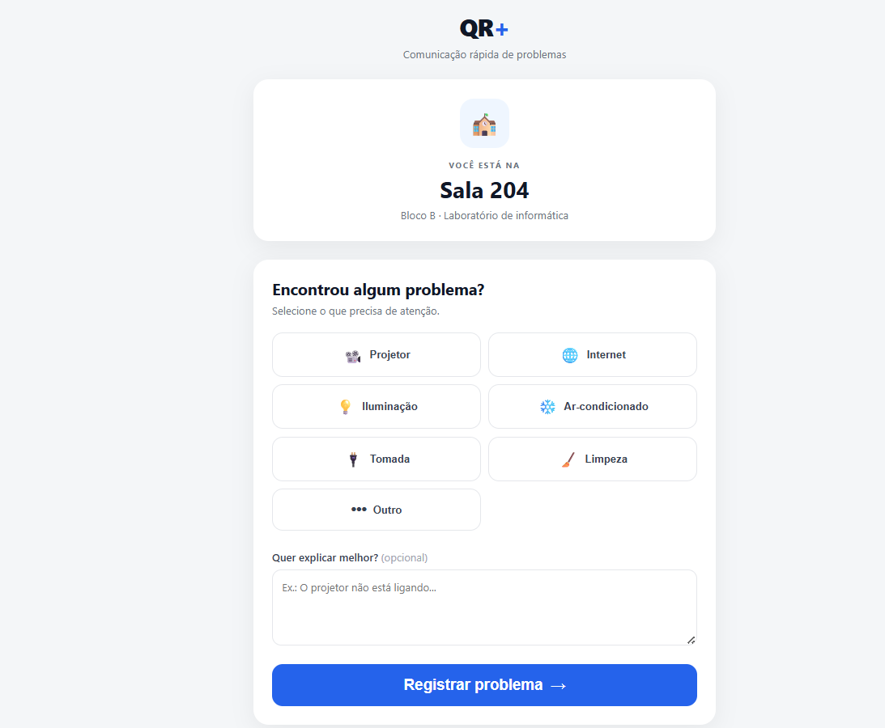
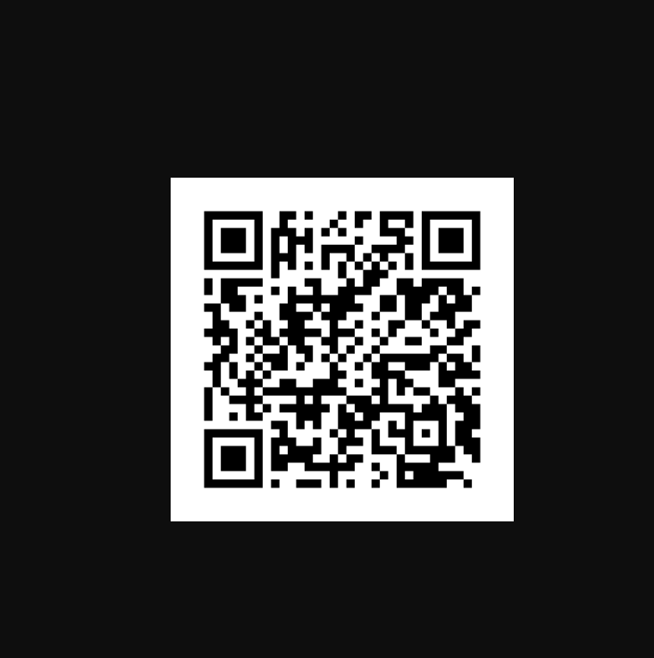

# 🏫 QR da Sala

Sistema web para registro rápido de problemas encontrados em salas e ambientes institucionais utilizando QR Codes.

## 💡 Sobre o projeto

O **QR da Sala** surgiu a partir de uma situação simples do cotidiano: quando uma pessoa encontra um problema em uma sala — como um projetor que não funciona, uma lâmpada queimada ou uma falha na internet — normalmente precisa descobrir quem é o responsável e encontrar uma forma de comunicar o problema.

A proposta é simplificar esse processo.

Cada sala possui um **QR Code exclusivo**. Ao escanear o código, o usuário é direcionado para uma página que identifica automaticamente a sala e permite registrar o problema em poucos segundos.

Não é necessário instalar um aplicativo.

### Exemplo

Um QR Code é colocado na entrada da Sala 204.

O usuário escaneia o código e acessa:

> **Sala 204**
>
> Encontrou algum problema?
>
> * Ar-condicionado
> * Projetor
> * Iluminação
> * Tomada
> * Internet
> * Limpeza
> * Outro

Após o envio, o chamado fica registrado no sistema para acompanhamento.

---

# 🎯 Objetivo

Criar uma solução simples, rápida e acessível para facilitar a comunicação de problemas relacionados à infraestrutura de salas e ambientes institucionais.

O projeto busca reduzir o tempo entre:

**identificação do problema → comunicação → atendimento → resolução.**

---

# 🚀 Funcionalidades

## Usuário

* Acessar a página através do QR Code.
* Identificar automaticamente a sala.
* Selecionar o tipo de problema.
* Adicionar uma descrição.
* Registrar o chamado.
* Receber confirmação do envio.

## Responsável

* Visualizar chamados.
* Identificar a sala relacionada ao chamado.
* Visualizar o tipo de problema.
* Consultar a data e horário do registro.
* Alterar o status do chamado.

### Status

* 🔴 Aberto
* 🟡 Em atendimento
* 🟢 Resolvido

---

# 🏗️ Arquitetura inicial

```text
                    📱
              Usuário / Celular
                     │
                     │ QR Code
                     ▼
              ┌──────────────┐
              │   Frontend   │
              │ HTML/CSS/JS  │
              └──────┬───────┘
                     │
                     │ HTTP
                     ▼
              ┌──────────────┐
              │    FastAPI   │
              │    Backend   │
              └──────┬───────┘
                     │
                     ▼
              ┌──────────────┐
              │    SQLite    │
              │    Banco     │
              └──────────────┘
                     │
                     ▼
              📊 Dashboard
```

---

# 📁 Estrutura do projeto

```text
qr-da-sala/
│
├── backend/
│   ├── app/
│   │   ├── models/
│   │   ├── schemas/
│   │   ├── routes/
│   │   ├── database/
│   │   └── main.py
│   │
│   ├── tests/
│   ├── requirements.txt
│   └── .env.example
│
├── frontend/
│   ├── index.html
│   ├── sala.html
│   ├── dashboard.html
│   ├── css/
│   └── js/
│
├── infrastructure/
│   └── terraform/
│
├── docs/
│
├── .gitignore
├── README.md
└── LICENSE
```

---

# 🗃️ Modelo inicial de dados

## Sala

Uma sala possui:

* `id`
* `nome`
* `bloco`
* `descricao`
* `qr_code`

Exemplo:

```text
id: 1
nome: Sala 204
bloco: Bloco B
descricao: Laboratório de informática
qr_code: sala-204
```

## Chamado

Um chamado possui:

* `id`
* `sala_id`
* `categoria`
* `descricao`
* `status`
* `created_at`
* `updated_at`

Exemplo:

```text
id: 15
sala_id: 1
categoria: projetor
descricao: Projetor não liga.
status: aberto
created_at: 2026-09-04 10:30
```

---

# 🔌 API

A API deverá disponibilizar inicialmente endpoints semelhantes a:

```text
GET    /salas
GET    /salas/{id}

POST   /chamados
GET    /chamados
GET    /chamados/{id}

PATCH  /chamados/{id}/status
```

---

# 📱 Fluxo do usuário

```text
1. Usuário encontra um problema
             ↓
2. Escaneia o QR Code da sala
             ↓
3. Sistema identifica a sala
             ↓
4. Usuário seleciona o problema
             ↓
5. Adiciona uma descrição
             ↓
6. Envia
             ↓
7. Sistema registra o chamado
             ↓
8. Usuário recebe confirmação
```

---

# 📊 Fluxo do responsável

```text
Novo chamado
      ↓
    Aberto
      ↓
Em atendimento
      ↓
   Resolvido
```

---

# ☁️ Evolução para Cloud

A primeira versão será desenvolvida localmente para validar a ideia.

Após o MVP, a aplicação poderá ser adaptada para uma arquitetura em nuvem.

Possível arquitetura:

```text
              Usuário
                 │
                 ▼
          CloudFront / S3
                 │
                 ▼
           API Gateway
                 │
                 ▼
              Lambda
                 │
                 ▼
             DynamoDB
```

A infraestrutura poderá ser provisionada utilizando **Terraform**.

---

# 🛠️ Tecnologias

* Python
* FastAPI
* HTML
* CSS
* JavaScript
* SQLite
* Git
* GitHub
* Terraform
* AWS

---

# 🎯 MVP — Primeira versão

O primeiro objetivo é construir uma versão funcional e pequena.

### Semana 1

* [ ] Criar estrutura do projeto
* [ ] Criar banco de dados
* [ ] Criar modelo de Sala
* [ ] Criar modelo de Chamado
* [ ] Criar API
* [ ] Criar página da sala
* [ ] Criar formulário de chamado
* [ ] Criar dashboard
* [ ] Implementar alteração de status
* [ ] Gerar QR Code para uma sala
* [ ] Realizar testes
* [ ] Documentar
* [ ] Subir no GitHub

---

# 🔮 Possíveis melhorias futuras

Depois do MVP, o projeto poderá evoluir com:

* Autenticação de responsáveis.
* QR Codes individuais para cada sala.
* Geração automática dos QR Codes.
* Notificação de novos chamados.
* Dashboard com métricas.
* Histórico de problemas por sala.
* Identificação de problemas recorrentes.
* Relatórios.
* Priorização de chamados.
* Upload de imagens.
* Monitoramento.
* Deploy automatizado.
* Infraestrutura como código.
* Arquitetura serverless na AWS.

---

# 🌱 Motivação

O projeto parte de uma ideia simples:

> **Problemas simples não deveriam exigir processos complicados para serem comunicados.**

O QR Code funciona como uma ponte entre o ambiente físico e um sistema digital, permitindo que qualquer pessoa registre uma ocorrência de forma rápida, sem necessidade de instalar aplicativos ou conhecer previamente o responsável pelo atendimento.

---

# 👩‍💻 Status
```
🟢 Fundação: 100%
🟢 Backend básico: 100%
🟢 Banco/modelagem: 100%
🟢 Frontend inicial: 100%
🟢 Integração Front ↔ API: 100%
🟢 QR Code: 100%
🟡 Dashboard: próximo
🔴 Deploy: depois
🔴 AWS/Terraform: depois
🔴 CI/CD: depois
🔴 Observabilidade: depois
```
# Autor 
Dev Amanda Campos Ximenes

# PRINT DA TELA INICIAL



# QR CODE GERADO




🚧 Projeto em desenvolvimento.

Versão atual: **MVP 0.1**
